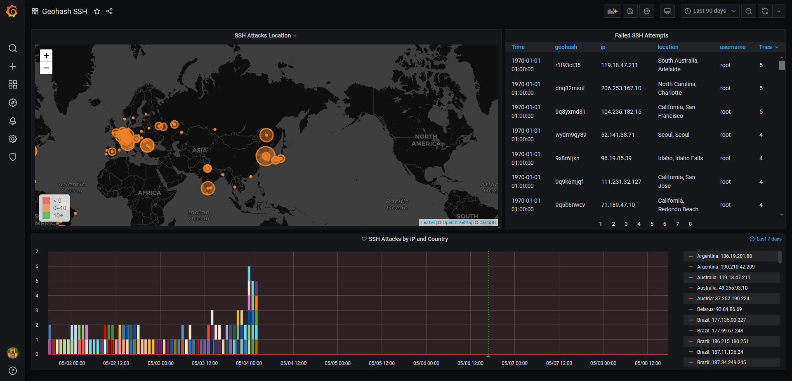

# Visualize bruteforce SSH attacker's location in real time


Thanks to Schkn for its original post https://devconnected.com/geolocating-ssh-hackers-in-real-time/

## Preview



[Grafana dashboard](https://grafana.com/grafana/dashboards/12323) id : __12323__

Multiarch supported `linux/amd64,linux/arm/v7,linux/arm64`

`docker run -e INFLUX_URL=influxdb -e INFLUX_DB=geoloc -p 7070:7070 --name ssh-log-to-influx acouvreur/ssh-log-to-influx`

## Prerequisites

- An InfluxDB instance (or use docker-compose.standalone.yml)
- A Grafana instance (or use docker-compose.standalone.yml)
- Docker
- Rsyslog

## Rsyslog configuration

Add this under `/etc/rsyslog.conf` to forward ssh auth failures to local server :
*Note: You should only add one at this moment, I'm working on a solution that can handles all modes*

### I have 'PasswordAuthentication' activated

```
template(name="OnlyMsg" type="string" string="%msg:::drop-last-lf%\n")
if $programname == 'sshd' then {
   if $msg startswith ' Failed' then {
      action(type="omfwd" target="127.0.0.1" port="7070" protocol="tcp" template="OnlyMsg")
   }
}
```


### I have 'PubkeyAuthentication' activated

```
template(name="OnlyMsg" type="string" string="%msg:::drop-last-lf%\n")
if $programname == 'sshd' then {
   if $msg startswith ' Invalid' then {
      action(type="omfwd" target="127.0.0.1" port="7070" protocol="tcp" template="OnlyMsg")
   }
}
```

## Start the TCP server

### With a bundled InfluxDB and Grafana

`docker-compose -f docker-compose.standalone.yml up`

### With an external InfluxDB

- ~~`INFLUX_URL`~~ *deprecated, use INFLUX_HOST instead*
- `INFLUX_PROTOCOL` *optional* *default: http* Protocol to use, http or https.
- `INFLUX_HOST` Influx (FQDN) host to connect to.
- `INFLUX_PORT` *optional* *default: 8086* Influx port to connect to.
- `INFLUX_USER` *optional* *default: root* Username for connecting to the database.
- `INFLUX_PWD` *optional* *default: root* Password for connecting to the database.
- `INFLUX_DB` Database to operate on.

*Note: You can use the Docker network FQDN if you put the service in the same Docker network as your InfluxDB instance. INFLUX_HOST will be `influx` if your service's name is influx.*

`docker-compose up -d`

## Test the TCP server

1. `docker-compose -f docker-compose.standalone.yml up`
2. `netcat localhost 7070`
3. type: `Failed password for username from 206.253.167.10 port 11111 ssh2`
4. Data should be parsed and added

## Debug configuration

* If you want to skip certificate validation, set `NODE_TLS_REJECT_UNAUTHORIZED` to 0, but don't do this without understanding the implications.
* `DEBUG_LEVEL`: level of logging in log4js, default is "info".
